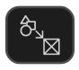
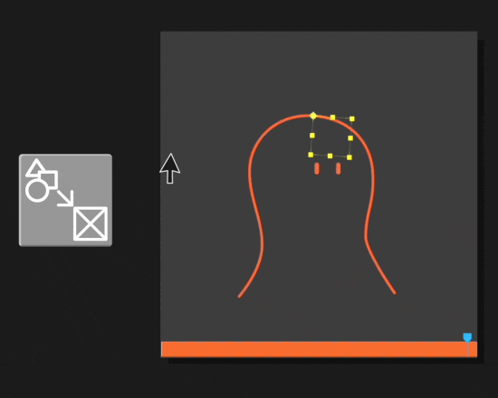
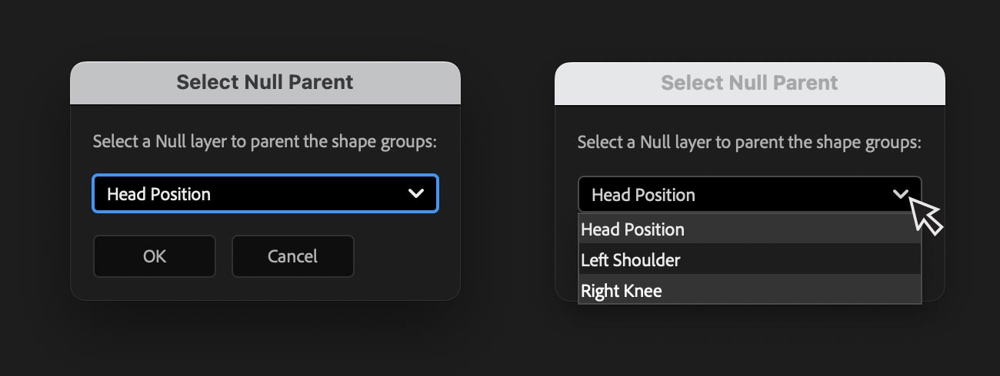
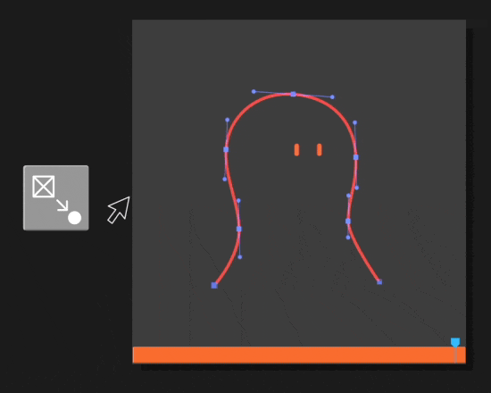
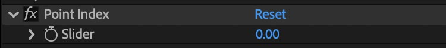
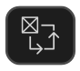
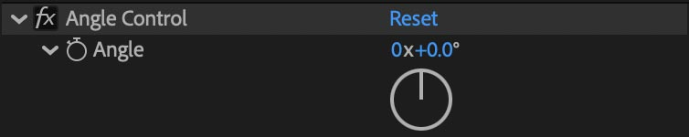

# Linking Tools
---
<h4  id="parent" style="display: flex; align-items: center; gap: 10px;">
  
  <span>1. Parent Shape Groups to Null</span>
</h4>


This function allows you to parent shape groups to a null, from within any shape layer.

**How to use:**

1. Select one or more points in the comp viewer or shape groups in the timeline
2. Click the button
3. A dialog will appear with a dropdown. Select the Null you want to parent your shape groups to.



```
💡 TIP: Use this function to add details to your character and speed up cleanup by reusing animations from other elements.
```
---
<h4  id="nulls" style="display: flex; align-items: center; gap: 10px;">
  
  <span>2. Create Nulls to Follow Points</span>
</h4>


Similar to the traditional Create Nulls to Follow Points script, with a few key differences:
- Create Nulls for selected points only
- Nulls are linked to shape groups names (not indices) so you can change the stacking order without breaking the connection.
- Each null comes with a Point Index slider, allowing you to reposition it if you edit the path by adding or removing points.



---

<h4  id="trace" style="display: flex; align-items: center; gap: 10px;">
  
  <span>3. Trace Path</span>
</h4>

Similar to the traditional Trace Path script: it creates a Null that moves around the edge of the path. Has a few key differences compared to the original:
- Nulls are linked to shape group names, so you can change stacking order without breaking connection
- Progress is controlled with an Angle Control, not a slider. That means it's easier to control how many times an element moves around the shape.



**Use this to:**
1. Attach other shapes to a path where there's no point and you don't want to create one
2. Have a shape move around another shape

