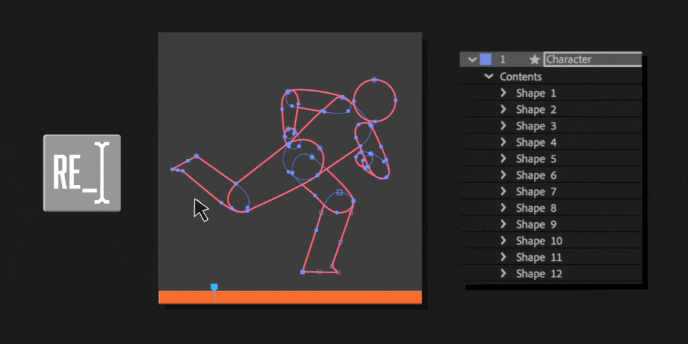
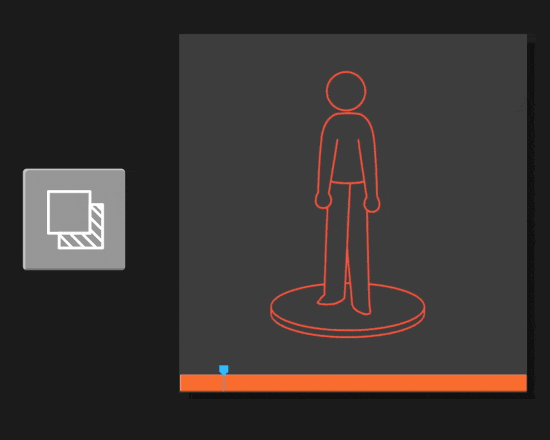
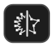
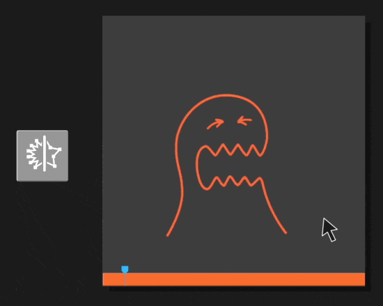
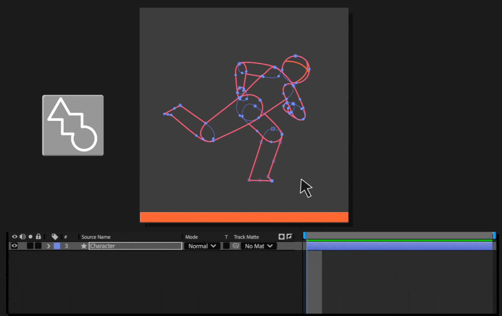
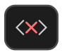

# Other Tools
---
<h4  id="renamer" style="display: flex; align-items: center; gap: 10px;">
  
  1. Renamer / Selector
</h4>

---
<h4  id="invert" style="display: flex; align-items: center; gap: 10px;">
  
  2. Clone & Invert Opacity
</h4>

---

<h4  id="copy" style="display: flex; align-items: center; gap: 10px;">
  
  3. Copy / Paste Shape States
</h4>

---
<h4  id="collapse" style="display: flex; align-items: center; gap: 10px;">
  
  4. Collapse Points
</h4>

---
<h4  id="key" style="display: flex; align-items: center; gap: 10px;">
  
  5. Add Keyframes
</h4>

---
<h4  id="delete" style="display: flex; align-items: center; gap: 10px;">
  
  6. Delete Points (keeping animation)
</h4>

---
<h4  id="masks" style="display: flex; align-items: center; gap: 10px;">
  
  7. Create Masks from Paths
</h4>

---
<h4  id="shade" style="display: flex; align-items: center; gap: 10px;">
  
  8. Create Shade Group
</h4>

---
<h4  id="zero" style="display: flex; align-items: center; gap: 10px;">
  
  9. Zero Transforms
</h4>

---
<h4  id="expressions" style="display: flex; align-items: center; gap: 10px;">
  
  10. Remove Expressions
</h4>

---