# Other Tools
---
<h4  id="onion" style="display: flex; align-items: center; gap: 10px;">
  
  <span>Onion Skin</span>
</h4>

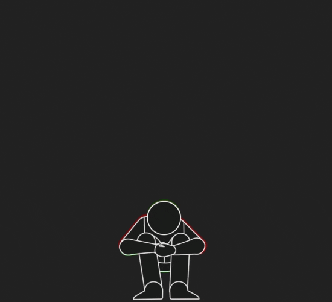
<br><br>
Shows forward and backward ghost overlays of nearby frames on the selected layer for reference. The onion skin is excluded from renders and nested comps.
<br><br>

| Modifier | Function | Action |
| -------- | :------: | ------ |
| Click | Activate / Deactivate | Select a layer and click to turn its onion skin on. Click again on a layer that's currently active to turn off every onion skin in the comp. Works on multiple selected layers at once. |
| SHIFT | Add / Remove | Adds a parallel onion skin on the selected layer, or removes just that layer's onion skin if it already has one. |
| OPT/ALT | Remove All | Removes every onion skin setup in the comp. |
| CMD/CTRL | Settings | 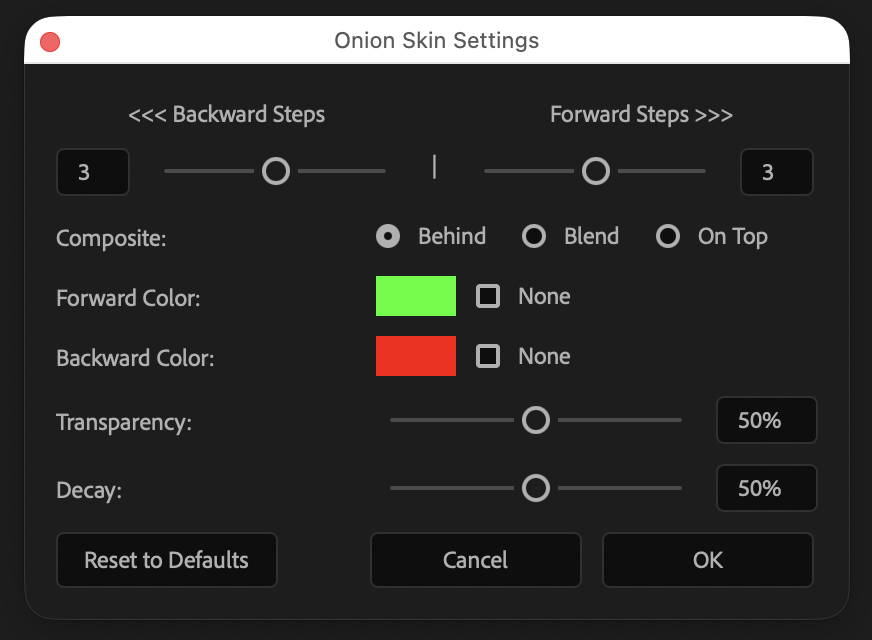<br><br>Opens the Onion Skin settings: steps forward/backward, colors (or no color), transparency, decay, and Behind/Blend/On Top positioning. Changes apply live to every onion skin already active in the comp. |

---
<h4  id="isolate" style="display: flex; align-items: center; gap: 10px;">
  
  <span>Isolate Selection</span>
</h4>


<br>

When working on a complex shape layer, it is easy to accidentally move points that should not be touched. Isolate Selection locks all paths in the layer except the ones you select, keeping everything else frozen in place while you edit.
<br><br>
The button icon changes when isolation is active. Click it again to release all locks.
<br><br>

| Modifier | Function | Action |
| -------- | :------: | ------ |
| Click | Isolate | Select one or more points in the comp viewer, then click to lock all other paths in the layer. Works on shape paths and mask paths. Selecting only mask paths also locks all shape paths, and vice versa. |
| Click (active) | Release all | When isolation is already active, clicking the button releases all locked paths across every layer in the comp. |
| SHIFT + selection | Add to isolated set | Adds the selected paths to the current isolated set without releasing the existing ones. |
| OPT/ALT + selection | Remove from isolated set | Removes the selected paths from the isolated set, locking them again. |
| SHIFT (nothing selected) | Restore previous selection | Restores the last isolated set. Very useful when focusing on a particular part of a character.|

> Locked paths are also immune to **Free Transform** (the double-click transform operation in the comp viewer).

> Mask path support respects the **Affect Masks** setting.

```
💡 IMPORTANT: To add or remove paths when Isolate Selection is active you'll need to use a rectangle selection, as the other points are not directly selectable (If the pen tool is active, holding opt/alt activates the selection tool).
```

---
<h4  id="renamer" style="display: flex; align-items: center; gap: 10px;">
  
  <span>Renamer / Selector</span>
</h4>
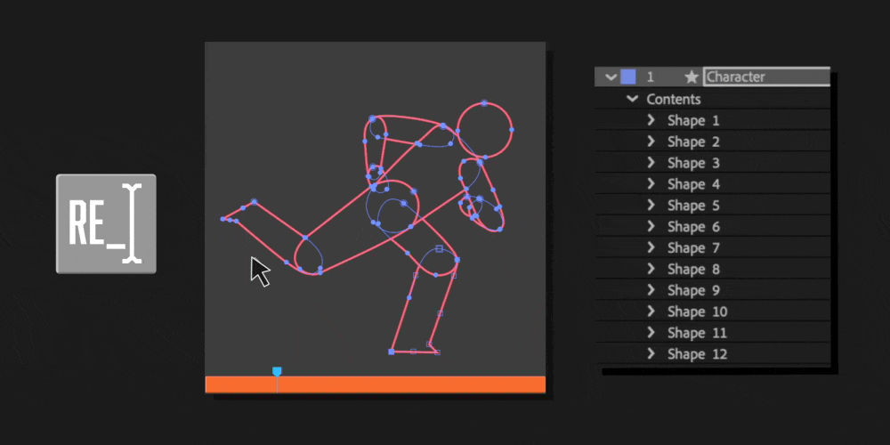
<br>
<br>
This button has triple function:
<br><br>

| Modifier       | Function | Action                       |
| ------------- | :--------: | --------------------------- |
| -      |    Renamer    | 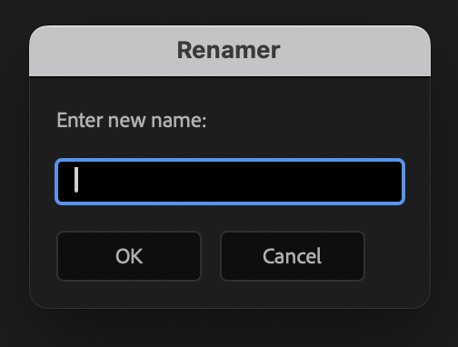<br><br>Renames selected Shape Groups or mask paths, and updates all other layers/expressions that reference them. When renaming a mask path, also updates `.mask("name")` references in expressions and any layer names that reference the mask.<br> If more than one shape or layer is selected, the function will append "01,02,03..." to the names.<br> <div class="alert-note"> ⚠️ The shape group and mask names need to be unique for the renamer to work fully. If names are not unique, expressions and other layers won’t be updated. </div>    |
| OPT/ALT |   Selector     | Reads a point selection in the comp viewer and selects the Shape Groups and keyframed properties related to it.<br><br> Double-tap `SS` on your keyboard to reveal and isolate the selected properties in the timeline.|
| CMD/CTRL |   Group Shapes     | Groups the selected shapes together. Type the name of the new group in the dialog.<br> <div class="alert-note"> ⚠️ Grouping shapes that have inverted opacity pairs, linked nulls or any other expression related function will break connections. </div>|


```
💡 TIP: The selector is incredibly useful for isolating and editing specific keyframes in the timeline.
```


---
<h4  id="invert" style="display: flex; align-items: center; gap: 10px;">
  
  <span>Clone & Invert Opacity</span>
</h4>
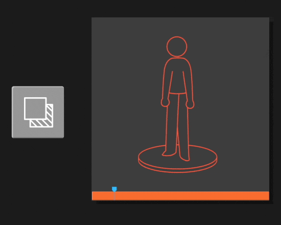
<br>
<br>
This button has quadruple function:
<br><br>

| Modifier | Function | Action |
| -------- | :------: | ------ |
|      -    |     Stacking   |  Clone Layer or Shape Groups and invert opacity. <br> Click again to invert opacity only.       |
|      OPT/ALT    |    Remove Pair       |     Remove inverted opacity pair (created for stacking) and resets the opacity of the selection   |
|     CMD/CTRL     |   Hide Selection  |    Hides the selection by setting 0% opacity keyframes.<br><div class="alert-note"> ⚠️ When an inverted opacity pair is present, opacity keyframes will be added to the pair as well. Make sure keyframes are aligned with the original object keyframes. </div>    |
|    SHIFT    |   Apply to parent group  |   Holding shift will invert the opacity of the parent group, not the selected shape(s) </div>    |


---

<h4  id="copy" style="display: flex; align-items: center; gap: 10px;">
  
  <span>Copy / Paste Shape States</span>
</h4>

| Modifier | Function | Action |
| -------- | :------: | ------ |
|     -     |  Copy state       |   Copy the current state of all selected paths. Works with multiple selections, including mask paths.     |
|     SHIFT     |  Copy selected points only       |   Copy only the currently selected points from each path (partial copy). Useful when you want to lock down specific control points without affecting the rest of the path.     |
|     CMD/CTRL     |    Paste to current frame      |  Paste the copied state to the current time.       |
|     SHIFT + CMD/CTRL     |    Paste to all keyframes in work area      |  Pastes the copied points to every keyframe within the work area for each affected path. After copying selected points with SHIFT, set the work area to the target range and use this to apply the fix across all keyframes at once.       |

> Mask path support respects the **Affect Masks** setting.

**How to use (Copy / Paste full state):**
1. Select one or more points in the comp viewer (accepts more than one path) and press the button.
2. Move the timeline to the desired point in time.
3. Hold CMD/CTRL and press the button to paste the copied shape state to the current time.
<br><br>

**How to use (Copy / Paste selected points across keyframes):**
1. Select the specific points you want to lock down in the comp viewer.
2. Hold SHIFT and press the button to copy those points.
3. Set the work area to the range of keyframes you want to update.
4. Hold SHIFT + CMD/CTRL and press the button to paste those points to every keyframe within the work area.

> Pasting only works if you keep the same paths selected.


---
<h4  id="tweak" style="display: flex; align-items: center; gap: 10px;">
  
  <span>Tweak Path</span>
</h4>

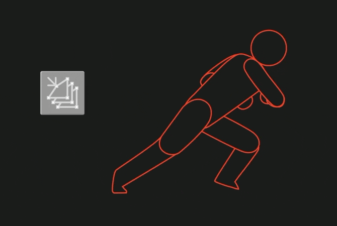

<br>

Tweak Path lets you make a shape correction on a single frame and automatically apply those changes to all keyframes within the work area, accounting for how the path is deforming at each frame. It's like "find and replace" for shape edits. Works on both shape paths and mask paths (when **Affect Masks** is enabled).

<br>

**THIS IS A TWO-STEP PROCESS:**
<br><br>

**Step 1 - Register a baseline:**
1. Select the points you want to adjust in the comp viewer.
2. Click the button to register the current state of those points as the baseline. The button icon will change to signal that a baseline is active.
<br><br>

**Step 2 - Apply the tweak:**
1. Adjust the path at the baseline frame - move the points to where they should be.
2. Set the work area to the range of keyframes you want to update.
3. Click the button again to apply the delta to all keyframes in the work area.
<br><br>

| Modifier | Function | Action |
| -------- | :------: | ------ |
|     -     |  Register baseline / Apply delta       |   First click registers the baseline. After adjusting the path, click again to apply the correction to all keyframes in the work area.   |
|     SHIFT (on Apply)     |    Keep baseline after applying      |  By default, the baseline is cleared after applying. Holding SHIFT keeps it active so you can continue tweaking and re-applying.   |
|     OPT/ALT     |    Clear baseline      |  Clears the stored baseline and resets the button to its default state without applying anything.   |

```
💡 TIP: Set a tight work area around only the keyframes that need the correction. Keyframes outside the work area are left untouched.
```

<div class="alert-note"> ⚠️ If a keyframe in the work area has a different point count than the baseline, the correction may not land as expected. Narrow the work area to exclude it. </div>

---
<h4  id="collapse" style="display: flex; align-items: center; gap: 10px;">
  
  <span>Collapse Points</span>
</h4>
Align points precisely on top of each other, or straighten them into a line. Works on both shape paths and mask paths (when **Affect Masks** is enabled).
<br>
<br>

| Modifier | Function | Action |
| -------- | :------: | ------ |
|     -     |  Collapse Points       |   Averages the position of all selected points, collapsing them to the same position.     |
|     SHIFT     |  Collapse to Line      |  Aligns all selected points to a straight line. The direction is detected automatically: if the points are spread horizontally they align to the average Y (horizontal line); if spread vertically they align to the average X (vertical line).     |
|     OPT/ALT     |  Zero bezier handles      |  Zero bezier handles while collapsing.      |

```
💡 TIP: Move points as close to the intended position as possible before using the tool for more predictable and precise results.
```

---
<h4  id="key" style="display: flex; align-items: center; gap: 10px;">
  
  <span>Add Keyframes</span>
</h4>
Add keyframes to path properties. Works across all selected shape layers simultaneously.
<br>
<br>

| Modifier | Function | Action |
| -------- | :------: | ------ |
|     -     |  Add keyframes     |   Add a keyframe to selected paths. If no path is selected, adds a keyframe to all paths in the layer. Works on all selected layers at once.    |


---
<h4  id="delete" style="display: flex; align-items: center; gap: 10px;">
  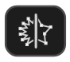
  <span>Delete Points (keeping animation)</span>
</h4>
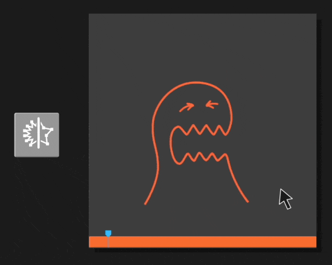
<br>
<br>
If you are familiar with shape layers in After Effects you probably know that deleting points in an animated path is a big NO NO. Not anymore.
<br>
<br>
<strong> Say hello to "Delete Points - Keep Animation" and goodbye to unwanted points.</strong>
<br>
<br>

**How to use:**
1. Select one or more points in the comp viewer at any point in time
2. Press the button
3. That's it!
<br>
<br>

**⚠️ Important:**
- After using this tool, you'll essentially have another version of the path on the same track. This means that any changes made to one of the versions (adding or deleting points the normal way) only affects the current version.
- You can have as many path versions as you want.
- Different shape versions need to have different point count at all times. If you delete or create more points and the count matches the neighboring versions, the versions will merge.

> This function only works on one path at a time.


---
<h4  id="masks" style="display: flex; align-items: center; gap: 10px;">
  
  <span>Create Masks from Paths</span>
</h4>
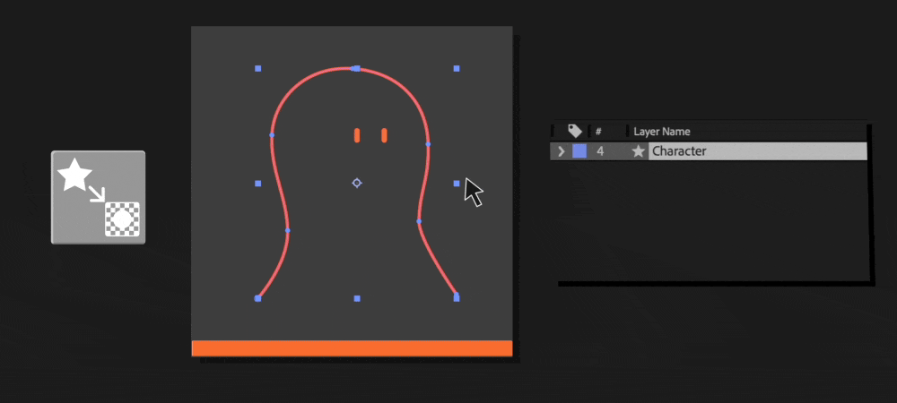
<br>
<br>

Clicking the button always opens a dialog where you choose where the masks go and how strokes are handled.<br>The masks remain linked to the original paths even if you move the target layer around.
<br><br>

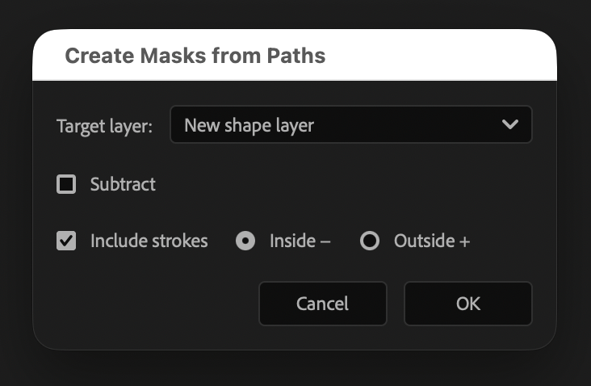
<br>
<br>

**Dialog options (remembered between sessions):**
<br>

- **Target layer:** choose where the masks are created:

| Option | Behavior |
| ------ | -------- |
| New shape layer *(default)* | Creates a new dedicated shape layer with the masks, placed directly above the source layer and parented to it. |
| Any existing layer | Applies the masks directly to that layer. Works for any layer type. |

- **Subtract:** when checked, creates Subtract masks instead of Add masks.
- **Include strokes:** when enabled, sets Mask Expansion on the created mask, linked to the source shape's stroke width. Expression-driven and respects stroke visibility dynamically.

| Direction | Behavior |
| --------- | -------- |
| Inside − *(default)* | Contracts the mask to the inner stroke edge. |
| Outside + | Expands the mask to the outer stroke edge. |


<span style="
  background-color: #d5d5d5;
  border: 1px solid #a9a9a9;
  border-radius: 15px;
  color: #1e1e1e;
  font-family: 'Roboto Mono', Monaco, courier, monospace;
  font-size: 0.8rem;
  padding: 0 25px 0 25px;
  white-space: pre-wrap;
  display: block;
">
💡 TIP: Great for faces and details that need to be inside a shape. Combine with <a href="/#/features-linking#nulls">Nulls Follow Paths</a> and <a href="/#/features-linking#parent">Parent Shape Group to Null</a>.<br>
</span>

---
<h4  id="clippingmask" style="display: flex; align-items: center; gap: 10px;">
  
  <span>Create Clipping Masks</span>
</h4>
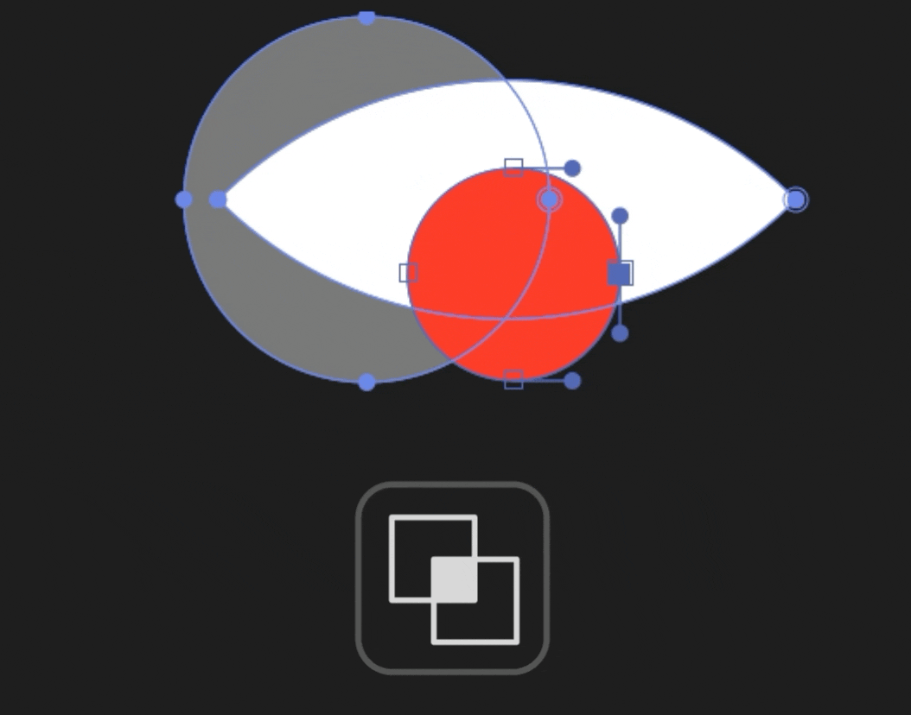
<br>
<br>
This button has triple function:
<br>
<br>

| Modifier | Function | Action |
| -------- | :------: | ------ |
|     -     |  Create Clipping Mask     |  Select a shape and press this button, then choose another shape to act as the mask. A dialog lets you set the options below before applying. Cleanup Master will automatically create the full Merge Paths hierarchy, clipping the first shape with the second.     |
|     OPT/ALT     |    Remove Masks from selected     |  Removes the masks from the selected shapes and return them to the original condition.|
|     CMD/CTRL     |    Convert Strokes to Fills     |  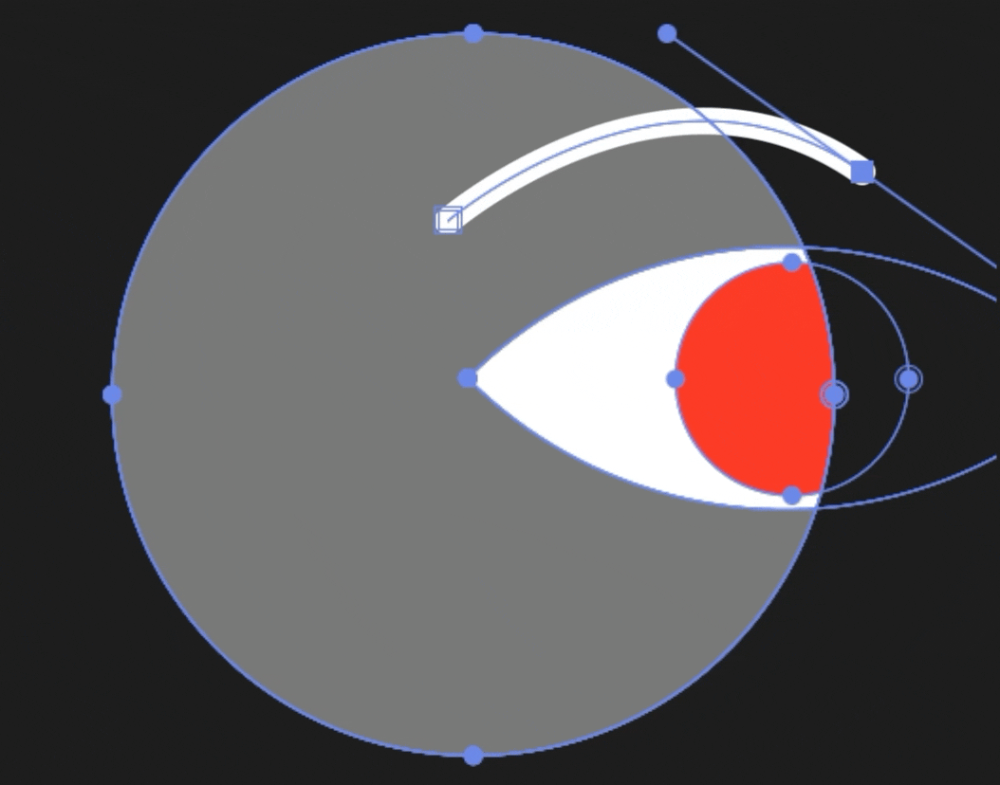  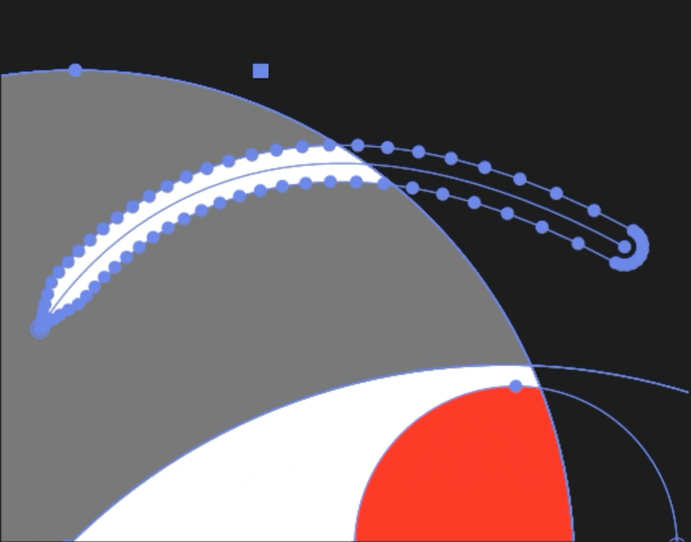<br><br>When clipping strokes, After Effects closes the resulting shape by default. This function avoids that by generating a filled shape that perfectly matches the original stroke, allowing strokes to be clipped just like any other shape. <strong>It supports all cap/join modes and TAPER!</strong><br><br><strong>The script will add 3 effects to your shape layer. </strong><br><br>You can:<br><br>• Control the resolution of the shape by adjusting the samples. <br>• Control the resolution of the line caps by changing the Cap Steps.<br>• Temporatily disable the shape to reduce point clutter by checking the checkbox.<br><br>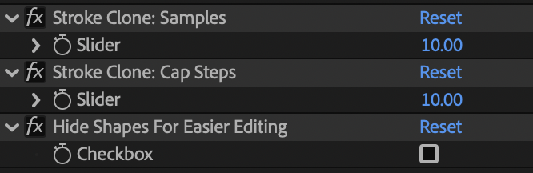 |

**Dialog options (remembered between sessions):**

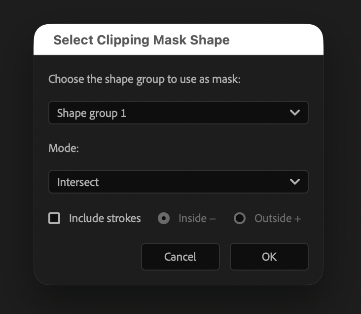
<br>
<br>

**Mode:** sets the Merge Paths blend mode applied to the mask group:

| Mode | Description |
| ---- | ----------- |
| Merge | Standard merge. |
| Add | Adds the shapes together. |
| Subtract | Subtracts the mask shape. |
| Intersect | Shows only the overlapping area. *(default)* |
| Exclude Intersections | Excludes the overlapping area. |

**Include strokes:** when enabled, adds an Offset Paths modifier to the mask group. The offset amount is expression-linked to the stroke widths of both shapes, so the clipping boundary automatically accounts for strokes.

| Direction | Behavior |
| --------- | -------- |
| Inside − *(default)* | Offsets inward, so the shapes are contained inside the strokes. |
| Outside + | Offsets outward, so the shapes sit on top of the strokes. |

> The selected shape's stroke is only included if it is currently visible. Toggling stroke visibility in AE adjusts the offset live.


<span style="
  background-color: #d5d5d5;
  border: 1px solid #a9a9a9;
  border-radius: 15px;
  color: #1e1e1e;
  font-family: 'Roboto Mono', Monaco, courier, monospace;
  font-size: 0.8rem;
  padding: 0 25px 0 25px;
  white-space: pre-wrap;
  display: block;
">
💡 TIP: You can clip multiple shapes at once and/or clip shapes in sequence. Play with combinations and see what works! <br>
</span>

---
<h4  id="shade" style="display: flex; align-items: center; gap: 10px;">
  
  <span>Create Shade Group</span>
</h4>
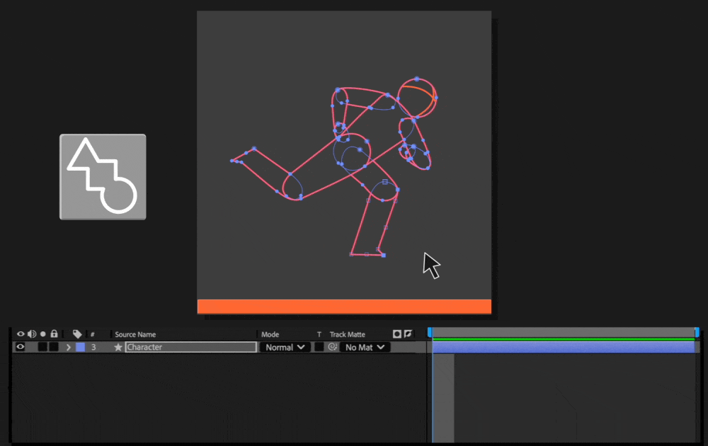
<br><br>
Think Pre-Comping for shape groups.<br>
This tool will create a clone of the current shape layer with only the selected shape groups.
<br>

| Modifier | Behavior |
| -------- | -------- |
| - | Creates the shade group using whatever's currently saved in Shade Group settings (see CMD/CTRL below). |
| SHIFT | Toggles the hidden originals visible/hidden for editing. Works even if the shade group layer itself is selected: it resolves to the original automatically, switches selection to it while editing, then restores whatever was selected before once you toggle back off. |
| OPT/ALT on shade group layer | Deletes the shade group and restores all hidden originals on the source layer. |
| OPT/ALT on source layer | Restores only the selected hidden groups on that layer. |
| CMD/CTRL | <!-- TODO: replace with  once the settings dialog screenshot exists --> Opens the Shade Group settings.<br><br>**Hide Originals** *(off by default)*: when creating a shade group, hides the selected original shapes (eye off) instead of leaving them visible alongside the clone.<br><br>**Properties linked to original** *(all on by default)*: Fills (including gradient fills), Strokes, Shape Transforms, Layer Transforms, and Shape Modifiers (Merge Paths, Offset Paths, Pucker & Bloat, and every other path operation). Any of these left unchecked has its link to the original removed right after the shade group is created, instead of tracking it live. |

> When Hide Originals is on, the clone's opacity dynamically references the original's: keyframes and static values are respected live, as long as Shape Transforms (which includes opacity) stays linked.

**Use this for:**
1. Combining shapes together for shading (adding inner shadow, inner glow effect, and so on...)
2. Also great for comping: create layers to be used as track mattes.
<br>

```
💡 TIP: Always do this as your last step, after all the animation is already cleaned up. As this will create a few more layers, some "comping problem-solving" will be required depending on the complexity of you animation.
```

---
<h4  id="zero" style="display: flex; align-items: center; gap: 10px;">
  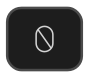
  <span>Zero Transforms</span>
</h4>
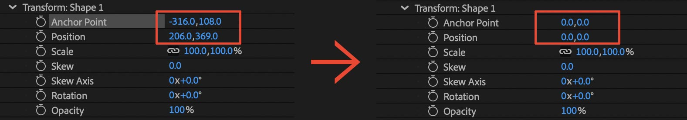
<br><br>
Sometimes, for various reasons, imported shape groups in after effects come with non-zero transform properties. This can cause alignment issues in several situations with different scripts and/or plugins.
<br>
Althought this function is already applied automatically when using anything in Cleanup Master, I decided to leave it as a standalone function in case you need it for other uses.

---
<h4  id="expressions" style="display: flex; align-items: center; gap: 10px;">
  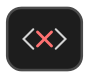
  <span>Remove Expressions</span>
</h4>
Remove expressions does what the name implies: Remove expressions. 
- Works for the whole layer
- Works for selected properties only
- Works with point selections in the comp viewer
<br>

**Use this for:**
1. Cleanup broken expressions
2. Remove unwanted expressions
<br>

---