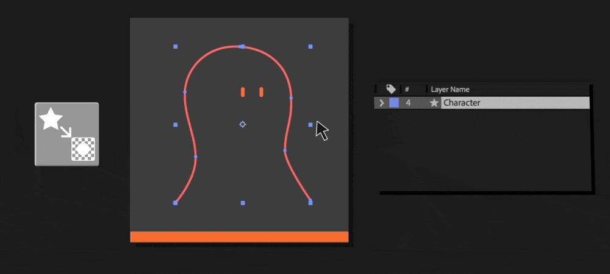

# Other Tools
---
<h4  id="renamer" style="display: flex; align-items: center; gap: 10px;">
  
  <span>1. Renamer / Selector</span>
</h4>

<br>
<br>
This button has double function:
<br><br>

| Modifier       | Function | Action                       |
| ------------- | :--------: | --------------------------- |
| -      |    Renamer    | <br><br>Renames selected Shapes Groups and all other layers/expressions that references it.<br> If more than one shape or layer is selected, the function will append "01,02,03..." to the names.<br> <div class="alert-note"> ⚠️ The shape group names need to be unique for the renamer to work fully. If names are not unique, expressions and other layers won’t be updated. </div>    |
| OPT/ALT |   Selector     | Reads a point selection in the comp viewer and selects the Shape Groups and keyframed properties related to it.<br><br> Double-tap `SS` on your keyboard to reveal and isolate the selected properties in the timeline.|
| CMD/CTRL |   Group Shapes     | Groups the selected shapes together. Type the name of the new group in the dialog.<br> <div class="alert-note"> ⚠️ Grouping shapes that have inverted opacity pairs, linked nulls or any other expression related function will break connections. </div>|


```
💡 TIP: The selector is incredibly useful for isolating and editing specific keyframes in the timeline.
```


---
<h4  id="invert" style="display: flex; align-items: center; gap: 10px;">
  
  <span>2. Clone & Invert Opacity</span>
</h4>

<br>
<br>
This button has triple function:
<br><br>

| Modifier | Function | Action |
| -------- | :------: | ------ |
|      -    |     Stacking   |  Clone Layer or Shape Groups and invert opacity. <br> Click again to invert opacity only.       |
|      OPT/ALT    |    Remove Pair       |     Remove inverted opacity pair (created for stacking) and resets the opacity of the selection   |
|     CMD/CTRL     |   Hide Selection  |    Hides the selection by setting 0% opacity keyframes.<br><div class="alert-note"> ⚠️ When an inverted opacity pair is present, opacity keyframes will be added to the pair as well. Make sure keyframes are aligned with the original object keyframes. </div>    |


---

<h4  id="copy" style="display: flex; align-items: center; gap: 10px;">
  
  <span>3. Copy / Paste Shape States</span>
</h4>

| Modifier | Function | Action |
| -------- | :------: | ------ |
|     -     |  Copy       |   Copy selected path state. Works with multiple selections.     |
|     OPT/ALT     |    Paste      |  Paste copied state.       |

**How to use:**
1. Select one or more points in the comp viewer (accepts more than one path) and presse the button.
2. Move the timeline to the desired point in time
3. Hold OPT/ALT and press the button to paste the copied shape state to the current time.

> Pasting only works if you keep the same paths selected.


---
<h4  id="collapse" style="display: flex; align-items: center; gap: 10px;">
  
  <span>4. Collapse Points</span>
</h4>
Align points precisely on top of each other with this function. 
<br>
<br>

| Modifier | Function | Action |
| -------- | :------: | ------ |
|     -     |  Collapse Points       |   Averages the position of all selected points, collapsing them to the same position.     |
|     OPT/ALT     |    Include bezier handles      |  Zero bezier handles while collapsing.      |

```
💡 TIP: Move points as close to the intended position as possible before using the tool for more predictable and precisa results.
```

---
<h4  id="key" style="display: flex; align-items: center; gap: 10px;">
  
  <span>5. Add Keyframes</span>
</h4>
Add keyframes to path properties.
<br>
<br>

| Modifier | Function | Action |
| -------- | :------: | ------ |
|     -     |  Add keyframes     |   Add Keyframes to all path properties in the layer.    |
|     OPT/ALT     |    Selected only      |  Add keyframe to selected paths only.     |


---
<h4  id="delete" style="display: flex; align-items: center; gap: 10px;">
  
  <span>6. Delete Points (keeping animation)</span>
</h4>

<br>
<br>
If you are familiar with shape layers in After Effects you probably know that deleting points in an animated path is a big NO NO. Not anymore.
<br>
<br>
<strong> Say hello to "Delete Points - Keep Animation" and goodbye to unwanted points.</strong>
<br>
<br>

**How to use:**
1. Select one or more points in the comp viewer at any point in time
2. Press the button
3. That's it!
<br>
<br>

**⚠️ Important:**
- After using this tool, you'll essentially have another version of the path on the same track. This means that any changes made to one of the versions (adding or deleting points the normal way) only affects the current version.
- You can have as many path versions as you want.
- Different shape versions need to have different point count at all times. If you delete or create more points and the count matches the neighboring versions, the versions will merge.

> This function only works on one path at a time.


---
<h4  id="masks" style="display: flex; align-items: center; gap: 10px;">
  
  <span>7. Create Masks from Paths</span>
</h4>

<br>
<br>
This button has double function:
<br>
<br>

| Modifier | Function | Action |
| -------- | :------: | ------ |
|     -     |  Create Masks     |   Creates another shape layer with masks attached to the current selction.    |
|     OPT/ALT     |    Create Subtract Masks      |  <br><br>Opens up a dialog for you to choose the target layer for the mask. Works for any type of layer.<br><br>After creation, the masks will remain linked to the original paths, even if you move the layer around.|


<span style="
  background-color: #d5d5d5;
  border: 1px solid #a9a9a9;
  border-radius: 15px;
  color: #1e1e1e;
  font-family: 'Roboto Mono', Monaco, courier, monospace;
  font-size: 0.8rem;
  padding: 0 25px 0 25px;
  white-space: pre-wrap;
  display: block;
">
💡 TIP: Great for faces and details that need to be inside a shape. Combine with <a href="/#/features-linking#nulls">Nulls Follow Paths</a> and <a href="/#/features-linking#parent">Parent Shape Group to Null</a>.<br>
</span>


---
<h4  id="shade" style="display: flex; align-items: center; gap: 10px;">
  
  <span>8. Create Shade Group</span>
</h4>

<br><br>
Think Pre-Comping for shape groups.<br>
This tool will create a clone of the current shape layer with only the selected shape groups.
<br>

**Use this for:**
1. Combining shapes together for shading (adding inner shadow, inner glowm effect, and so on...)
2. Also great for comping: create layers to be used as track mattes.
<br>

```
💡 TIP: Always do this as your last step, after all the animation is already cleaned up. As this will create a few more layers, some "comping problem-solving" will be required depending on the complexity of you animation.
```

---
<h4  id="zero" style="display: flex; align-items: center; gap: 10px;">
  
  <span>9. Zero Transforms</span>
</h4>

<br><br>
Sometimes, for various reasons, imported shape groups in after effects come with non-zero transform properties. This can cause alignment issues in several situations with different scripts and/or plugins.
<br>
Althought this function is already applied automatically when using anything in Cleanup Master, I decided to leave it as a standalone function in case you need it for other uses.

---
<h4  id="expressions" style="display: flex; align-items: center; gap: 10px;">
  
  <span>10. Remove Expressions</span>
</h4>
Remove expressions does what the name implies: Remove expressions. 
- Works for the whole layer
- Works for selected properties only
- Works with point selections in the comp viewer
<br>

**Use this for:**
1. Cleanup broken expressions
2. Remove unwanted expressions
<br>

---