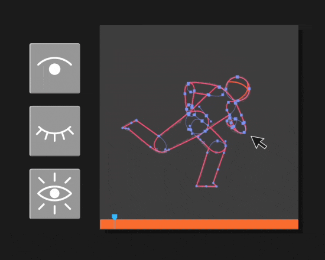
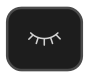

# Visibility Tools


---

<h4 id="solo" style="display: flex; align-items: center; gap: 10px;">
  
  <span>1. Solo Selected Shapes</span>
</h4>

Temporarily isolates the selected paths by hiding all others in the same layer. Works with either a point selection in the comp-viewer or a direct selection in the timeline.

**Use this to:**

- Clean up or edit only the selected shapes without visual clutter
- Preview only the selected shapes in the Comp viewer

```
💡 TIP: You can solo shapes, select specific points and use Restore Visibility to edit in context, as the points will remain selected.
```
---

<h4 id="hide" style="display: flex; align-items: center; gap: 10px;">
  
  <span>2. Hide Selected Shapes</span>
</h4>

The opposite of Solo. Hides all selected paths. This makes it easier to reveal and work on specific shapes without any distractions.

Works with either a point selection in the comp-viewer or a direct selection in the timeline.


**Use this to:**

- Hide shapes you are not currently working with
- Refine a Solo selection by hiding unwanted shapes
---
<h4 id="reveal" style="display: flex; align-items: center; gap: 10px;">
  
  <span>3. Restore Shape Visibility</span>
</h4>

Makes ALL shape groups in a layer visible. 
> The tool does not store previous selection states.
