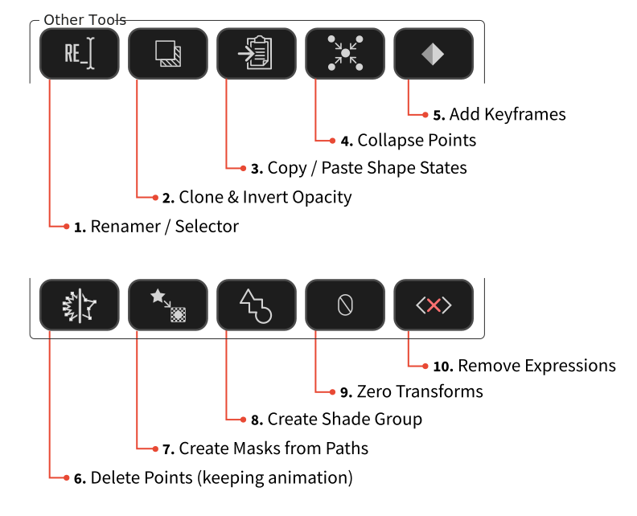

# Features
---
### [Visibility Tools](features-visibility.md#visibility-tools)

1. [**Solo Selected Shapes**](features-visibility.md#solo)
2. [**Hide Selected Shapes**](features-visibility.md#hide)
3. [**Restore Shape Visibility**](features-visibility.md#reveal)
---
### [Linking Tools](features-linking.md#linking-tools)

1. [**Parent Shape Groups to Null**](features-linking.md#parent)
2. [**Nulls Follow Points**](features-linking.md#nulls)
3. [**Trace Path**](features-linking.md#trace)
---
### [Other Tools](features-other.md#other-tools)

1. **Renamer / Selector**
2. **Clone & Invert Opacity**
3. **Copy / Paste Shape States**
4. **Collapse Points**
5. **Add Keyframes**
6. **Delete Points (Keeping Animation)**
7. **Create Masks from Paths**
8. **Create Shade Group**
9. **Zero Transforms**
10. **Remove Expressions**