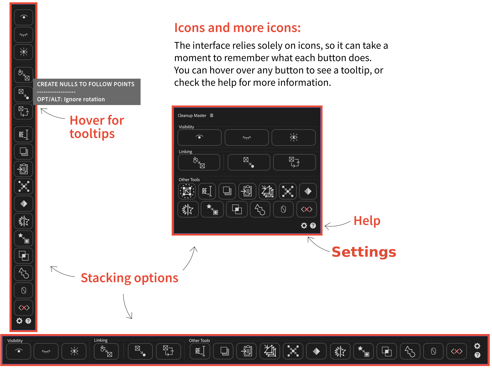

# Interface

---

## Settings

> **[IMAGE PLACEHOLDER]**
> *Screenshot of the Settings dialog showing the checkboxes organized by section (Main Panels, Other Tools Row 1, Other Tools Row 2), with a few boxes unchecked to show the panel adapting and hiding the corresponding buttons.*

 

Click the **gear icon** at the bottom of the panel to open the Settings dialog.

From there you can choose which features are visible in the panel. Unchecking a feature hides its button entirely, freeing up space and keeping the toolbar focused on what you actually use.

Features are grouped by section:

| Section | Features |
| ------- | -------- |
| **Main Panels** | Visibility Tools, Linking Tools |
| **Other Tools - Row 1** | Rename / Group, Inverted Opacity, Copy / Paste Path, Tweak Path, Align Points, Add Keyframes |
| **Other Tools - Row 2** | Shape Version, Masks, Clipping Mask, Shade Group, Zero Transforms, Remove Expressions |

Rows are hidden automatically when all their buttons are turned off. Click **Reset Defaults** to turn everything back on.

