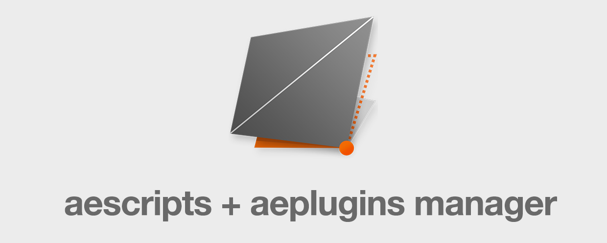

# Trial
---
<h3 id="compatibility">How to get a trial</h3>

1. You can download a trial version directly in the product page on [aescripts](https://aescripts.com/cleanup-master/) and install it [manually](installation.md#option-1). 

  
2. Or you can use the [aescripts + aeplugins Manager](https://aescripts.com/learn/aescripts-aeplugins-manager-app/), going to the "Account" menu (top-bar) and selecting "Cleanup Master" on the list and install.  

---
## Trial Limitations
I’m confident this toolbar will transform the way you work in After Effects and quickly become an essential part of your daily workflow. That said, I encourage you to give it a try before purchasing.
The trial version includes the following limitations:
- 10 days
- Maximum of <strong>5 non-null layers</strong> in the same comp
- Maximum of <strong>40 keyframes</strong> in a comp